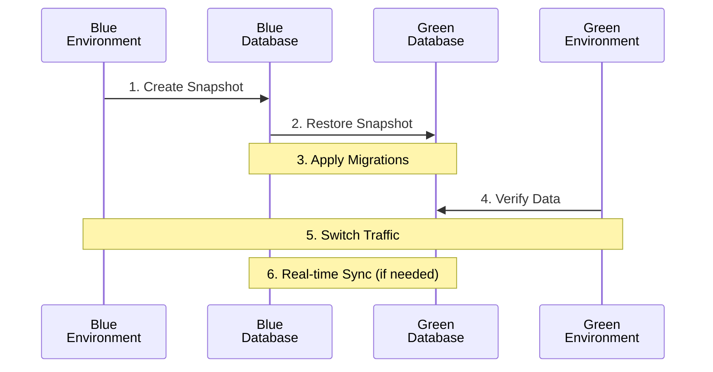

This guide outlines a common and straightforward approach to database synchronization in Blue-Green deployments using database snapshots and migrations.

## Simplified Sync Approach

## Step-by-Step Workflow
1. **Create Database Snapshot**
Create a point-in-time snapshot of the Blue (current production) database.

   - Tools: PostgreSQL pg_dump, MySQL mysqldump
   - Instructions: [How to Create and Restore PostgreSQL Database Snapshots](https://www.postgresql.org/docs/current/backup-dump.html)
2. **Restore Snapshot to Green Database**
Restore the snapshot to the Green (new version) database environment.

   - Tools: PostgreSQL pg_restore, MySQL source command
   - Instructions: [Restoring a PostgreSQL Database](https://www.postgresql.org/docs/current/backup-dump.html#BACKUP-DUMP-RESTORE)
3. **Apply Database Migrations**
Run any necessary database migrations to update the schema or data for the new version.

   - Tools: Flyway, Liquibase
   - Resources:
     - [Database Migration Strategies with Flyway](https://flywaydb.org/documentation/concepts/migrations)
     - [Liquibase Best Practices](https://www.liquibase.org/get-started/best-practices)
4. **Verify Data Integrity**
Ensure that the Green database is consistent and contains all necessary data.

   - Tools: pgcompare for PostgreSQL, mysqldbcompare for MySQL
   - Guide: [Verifying Database Consistency](https://www.postgresql.org/docs/current/app-pgcompare.html)
5. **Switch Traffic**
Gradually route traffic from Blue to Green environment.

   - Tools: Load balancers (e.g., NGINX, HAProxy), DNS switches
   - Article: [Blue-Green Deployments with Load Balancers](https://martinfowler.com/bliki/BlueGreenDeployment.html)
6. **Implement Real-time Sync (Optional)**
If needed, set up real-time synchronization between Blue and Green databases during the transition period.

   - Tools: Debezium for Change Data Capture, Postgres Logical Replication
   - Tutorial: [Setting Up Change Data Capture with Debezium](https://debezium.io/documentation/reference/tutorial.html)
## Best Practices
- Test thoroughly: Always test the sync and migration process in a staging environment first.
- Create backups: Before starting the process, create full backups of both Blue and Green databases.
- Monitor closely: Use monitoring tools to watch for any issues during the sync and switch process.
- Have a rollback plan: Prepare a strategy to quickly revert to the Blue environment if needed.
- Minimize downtime: Schedule the switch during low-traffic periods and optimize your process for speed.
## Further Reading

- [Blue-Green Deployment: A Comprehensive Guide](https://martinfowler.com/bliki/BlueGreenDeployment.html)
- [Zero Downtime Database Migrations](https://www.percona.com/blog/2015/08/26/zero-downtime-schema-changes-in-mysql/)
- [Strategies for Database DevOps](https://www.red-gate.com/simple-talk/databases/sql-server/database-devops-sql-server/)
Remember, the specific steps and tools may vary depending on your database technology, application architecture, and specific requirements. Always adapt this general workflow to fit your unique situation.
