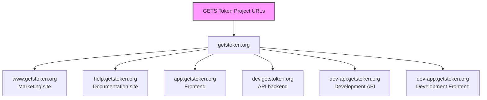
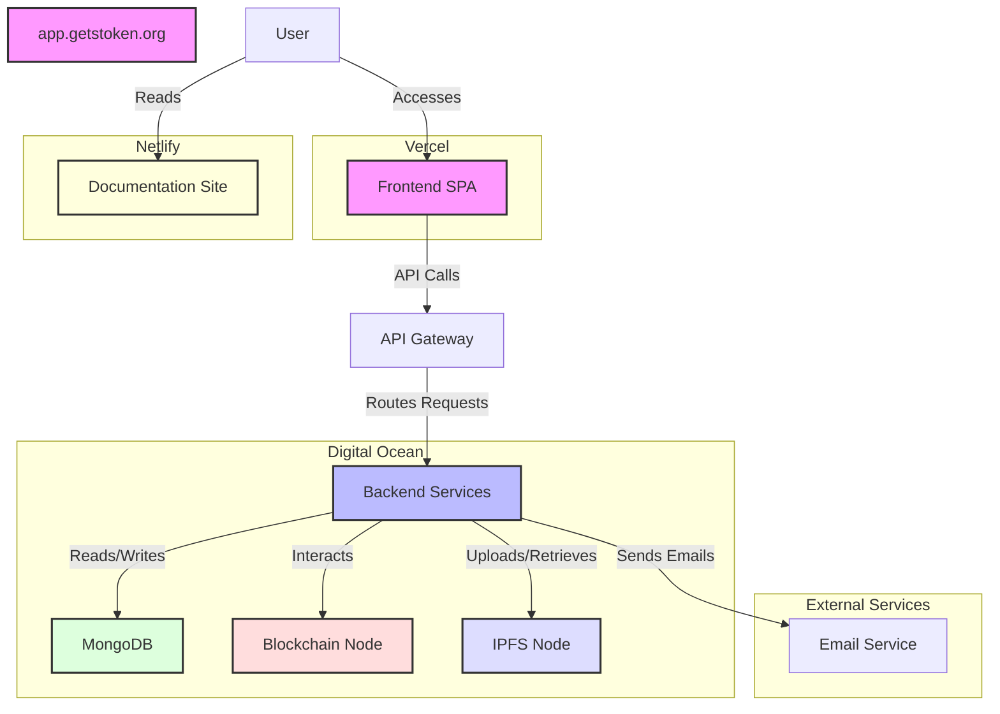

## GetSmart Token Digital Presence

```mermaid
graph TD
    title[GETS Token Project URLs]
    style title fill:#f9f,stroke:#333,stroke-width:2px

    A[getstoken.org]
    A --> B[www.getstoken.org<br>Marketing site]
    A --> C[help.getstoken.org<br>Documentation site]
    A --> D[app.getstoken.org<br>Frontend]
    A --> E[dev.getstoken.org<br>API backend]
    A --> F[dev-api.getstoken.org<br>Development API]
    A --> G[dev-app.getstoken.org<br>Development Frontend]

    title --> A


```

```mermaid
graph TD
    title[app.getstoken.org]
    style title fill:#f9f,stroke:#333,stroke-width:2px

    A[User] -->|Accesses| B[Frontend SPA]
    A -->|Reads| I[Documentation Site]
    B -->|API Calls| C[API Gateway]
    C -->|Routes Requests| D[Backend Services]
    subgraph "Digital Ocean"
        D -->|Reads/Writes| E[MongoDB]
        D -->|Interacts| F[Blockchain Node]
        D -->|Uploads/Retrieves| G[IPFS Node]
    end
    subgraph "External Services"
        F
        G
        H[Email Service]
    end
    D -->|Sends Emails| H
    subgraph "Vercel"
        B
    end
    subgraph "Netlify"
        I
    end
    style B fill:#f9f,stroke:#333,stroke-width:2px
    style D fill:#bbf,stroke:#333,stroke-width:2px
    style E fill:#dfd,stroke:#333,stroke-width:2px
    style F fill:#fdd,stroke:#333,stroke-width:2px
    style G fill:#ddf,stroke:#333,stroke-width:2px
    style I fill:#ffd,stroke:#333,stroke-width:2px
```

