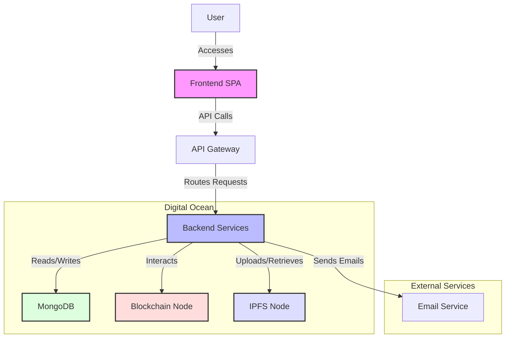

```mermaid
graph TD
    A[User] -->|Accesses| B[Frontend SPA]
    B -->|API Calls| C[API Gateway]
    C -->|Routes Requests| D[Backend Services]
    
    subgraph "Digital Ocean"
    D -->|Reads/Writes| E[MongoDB]
    D -->|Interacts| F[Blockchain Node]
    D -->|Uploads/Retrieves| G[IPFS Node]
    end
    
    subgraph "External Services"
    F
    G
    H[Email Service]
    end
    
    D -->|Sends Emails| H

    style B fill:#f9f,stroke:#333,stroke-width:2px
    style D fill:#bbf,stroke:#333,stroke-width:2px
    style E fill:#dfd,stroke:#333,stroke-width:2px
    style F fill:#fdd,stroke:#333,stroke-width:2px
    style G fill:#ddf,stroke:#333,stroke-width:2px


```