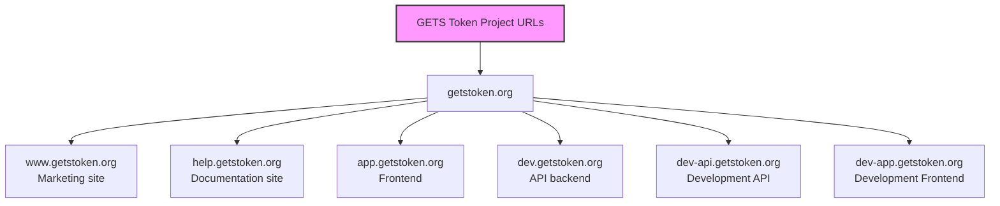
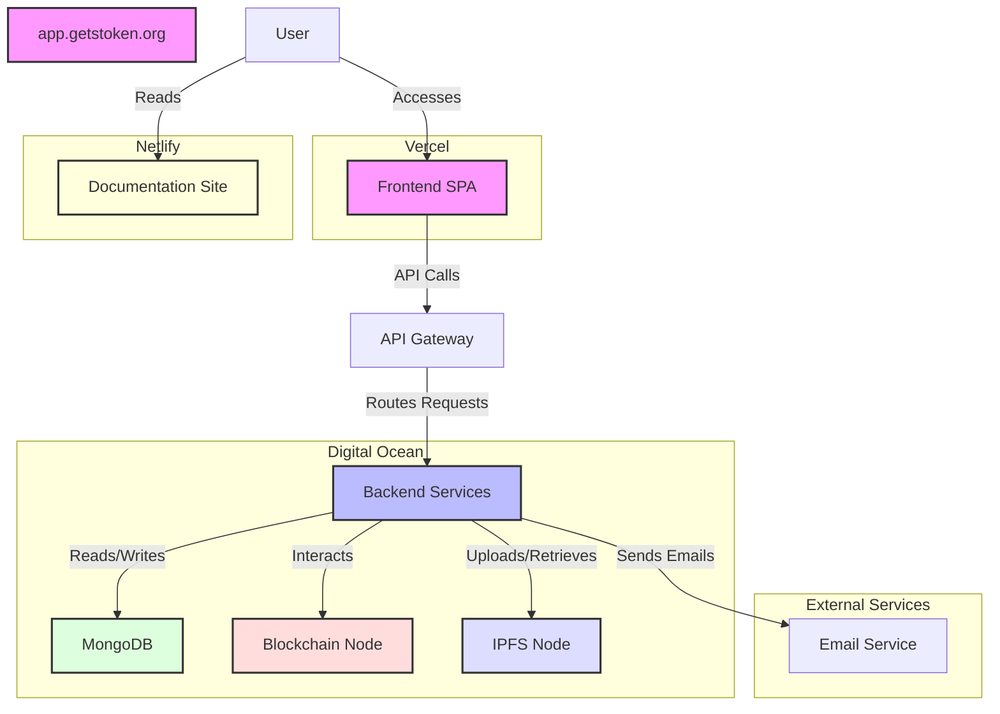

## GetSmart Token Digital Presence

The internal documentation site (`devdocs.getstoken.org`) is a Hugo static site. It is automatically built and deployed from the `main` branch of the GitHub repository (`getsmart-token/gs_help_int`) to Cloudflare Pages.
