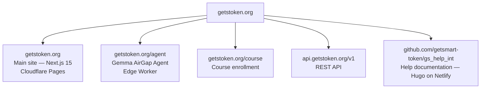
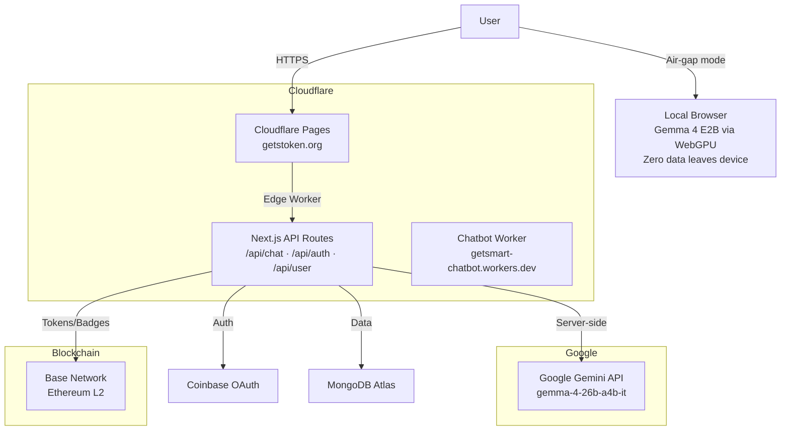

## GetSmart Token Platform Architecture

## Active URLs

| URL | Description | Host |
|---|---|---|
| [getstoken.org](https://getstoken.org) | Main site | Cloudflare Pages |
| [getstoken.org/agent](https://getstoken.org/agent) | Gemma AirGap Agent terminal | Cloudflare Pages |
| [getstoken.org/course](https://getstoken.org/course) | Course enrollment | Cloudflare Pages |
| [api.getstoken.org/v1](https://api.getstoken.org/v1) | REST API | Cloudflare Workers |
| [github.com/getsmart-token/gs_help_int](https://github.com/getsmart-token/gs_help_int) | Help documentation | GitHub / Netlify |

## Tech Stack

| Layer | Technology |
|---|---|
| Frontend | Next.js 15 (App Router) |
| Hosting | Cloudflare Pages |
| Serverless | Cloudflare Edge Workers |
| AI (cloud) | Google Gemma 4 via Gemini API |
| AI (local) | LiteRT / MediaPipe / WebGPU in-browser |
| Auth | Coinbase OAuth |
| Database | MongoDB Atlas |
| Blockchain | Base network (Ethereum L2) |
| Chatbot | Cloudflare Workers |
| Docs | Hugo + Docsy on Netlify |
