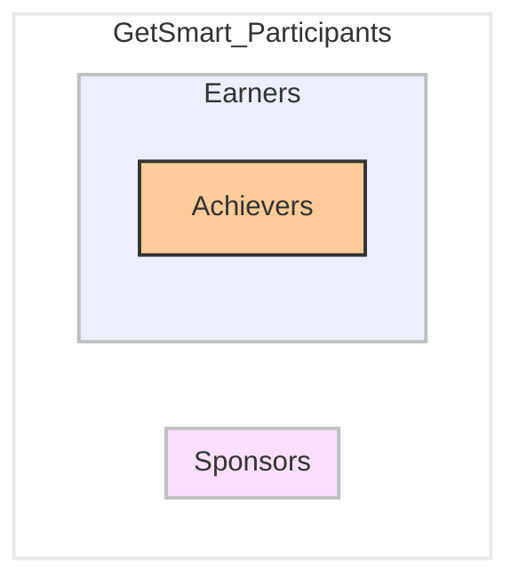

# Who's who on the GetSMart Token platform

The GetSMart Token platform has three primary user roles: Sponsors, Achievers, and Earners. Understanding these roles is crucial for effectively using the system.

## Sponsor Accounts

Sponsors are organizations or individuals who create and award digital badges.

### Creating a Sponsor Account

1. Navigate to the sponsor registration page
2. Provide required information (name, email, organization details)
3. Complete KYC/AML verification process
4. Set up a secure wallet for badge management

### Managing a Sponsor Account

- Create and customize digital badges
- Define achievement criteria for each badge
- Award badges to deserving achievers
- View analytics on awarded badges

## Achiever Accounts

Achievers are individuals who earn and showcase digital badges for their accomplishments.

### Creating an Achiever Account

1. Go to the achiever registration page
2. Enter personal details (name, email, optional professional information)
3. Set up a wallet to receive and store digital badges
4. Customize profile settings

### Managing an Achiever Account

- View available badges and their criteria
- Submit evidence for badge completion
- Receive and showcase earned badges
- Share achievements on social platforms

## Earner Accounts

Anyone who holds GetSmart Tokens ($GETS) can be an Earner, earning additional tokens when staking their tokens towards sponsored badges.

### Becoming an Earner

1. Acquire GetSmart Tokens ($GETS) through approved exchanges or platforms
2. Hold tokens in a compatible wallet
3. Participate in the token earning mechanism

### Earner Activities

- Hold $GETS tokens in your wallet
- Earn additional tokens based on the tokenomics of staking $GETS
- Participate in governance decisions (if applicable)
- Monitor earnings and token value through the platform dashboard

## Switching Between Roles

Users can hold multiple roles simultaneously:

- Easy switching between sponsor, achiever, and earner dashboards
- Separate management of activities for each role
- Clear distinction between created badges, earned badges, and token earnings

## Security and Privacy

- All account types have robust security measures (See [docs/security-privacy](Security & Privacy))
- Users control the visibility of their information, achievements, and token holdings
- Option to enable two-factor authentication for added security

For more information on how to use the platform in any of these roles, please refer to our detailed user guides in the [Community and Support](/community-and-support) section.
